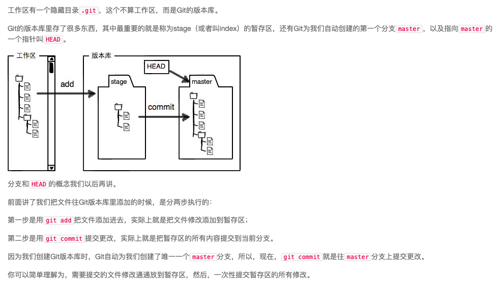

- 初始化一个Git仓库，使用git init命令。

- 添加文件到Git仓库，分两步：

- 使用命令git add <file>，注意，可反复多次使用，添加多个文件；
- 使用命令git commit -m <message>，完成。

- HEAD指向的版本就是当前版本，因此，Git允许我们在版本的历史之间穿梭，使用命令git reset --hard commit_id。

- 穿梭前，用git log可以查看提交历史，以便确定要回退到哪个版本。

- 要重返未来，用git reflog查看命令历史，以便确定要回到未来的哪个版本。

- 暂存区

- 查看工作区和版本库的区别：
    “第一次修改 -> git add -> 第二次修改 -> git commit”

    你看，我们前面讲了，Git管理的是修改，当你用git add命令后，在工作区的第一次修改被放入暂存区，准备提交，但是，在工作区的第二次修改并没有放入暂存区，所以，git commit只负责把暂存区的修改提交了，也就是第一次的修改被提交了，第二次的修改不会被提交。

    提交后，用git diff HEAD -- readme.txt命令可以查看工作区和版本库里面最新版本的区别

- 撤销修改：
1. 修改尚未存入暂存区：git checkout -- _filename_ 恢复到版本库中的版本
2. 修改已经存入暂存区：git checkout -- _filename_ 恢复到暂存区中的版本
                    git reset HEAD <file> 撤销暂存区的修改
3. 修改已经commit进入版本库但是没有推送到remote rep：git reset _commitid_ 撤销工作区的修改

- 删除文件
1. 一般情况下，你通常直接在文件管理器中把没用的文件删了，或者用rm命令删了
2. Git知道你删除了文件，因此，工作区和版本库就不一致了，git status命令会立刻告诉你哪些文件被删除了
3. 现在你有两个选择，一是确实要从版本库中删除该文件，那就用命令git rm删掉，并且git commit, 如果一个文件已经被提交到版本库，那么你永远不用担心误删，但是要小心，你只能恢复文件到最新版本，你会丢失最近一次提交后你修改的内容; 
4. 另一种情况是删错了，因为版本库里还有呢，所以可以很轻松地把误删的文件恢复到最新版本, git checkout其实是用版本库里的版本替换工作区的版本，无论工作区是修改还是删除，都可以“一键还原”。

- 远程库
1. 要关联一个远程库，使用命令git remote add origin git@server-name:path/repo-name.git；

2. 关联一个远程库时必须给远程库指定一个名字，origin是默认习惯命名；

3. 关联后，使用命令git push -u origin master第一次推送master分支的所有内容；
    - 由于远程库是空的，我们第一次推送master分支时，加上了-u参数，Git不但会把本地的master分支内容推送的远程新的master分支，还会把本地的master分支和远程的master分支关联起来，在以后的推送或者拉取时就可以简化命令。

4. 此后，每次本地提交后，只要有必要，就可以使用命令git push origin master推送最新修改；

5. 如果添加的时候地址写错了，或者就是想删除远程库，可以用git remote rm <name>命令。使用前，建议先用git remote -v查看远程库信息;然后，根据名字删除，比如删除origin; 
    - 此处的“删除”其实是解除了本地和远程的绑定关系，并不是物理上删除了远程库。远程库本身并没有任何改动。要真正删除远程库，需要登录到GitHub，在后台页面找到删除按钮再删除。

6. 要克隆一个仓库，首先必须知道仓库的地址，然后使用git clone命令克隆。Git支持多种协议，包括https，但ssh协议速度最快。

- 分支管理
1. 我们创建dev分支，然后切换到dev分支：$ git checkout -b dev
2. 然后，我们就可以在dev分支上正常提交，然后提交;
3. dev分支的工作完成后切换回master分支, 把dev分支的工作成果合并到master分支上：git merge dev; git merge命令用于合并指定分支到当前分支。
4. 合并完成后，就可以放心地删除dev分支了: git branch -d dev
    - 因为创建、合并和删除分支非常快，所以Git鼓励你使用分支完成某个任务，合并后再删掉分支，这和直接在master分支上工作效果是一样的，但过程更安全。

- SWITCH   
    我们注意到切换分支使用git checkout <branch>，而前面讲过的撤销修改则是git checkout -- <file>，同一个命令，有两种作用，确实有点令人迷惑。

    实际上，切换分支这个动作，用switch更科学。因此，最新版本的Git提供了新的git switch命令来切换分支：

    创建并切换到新的dev分支，可以使用：

    $ git switch -c dev
    直接切换到已有的master分支，可以使用：

    $ git switch master
    使用新的git switch命令，比git checkout要更容易理解。